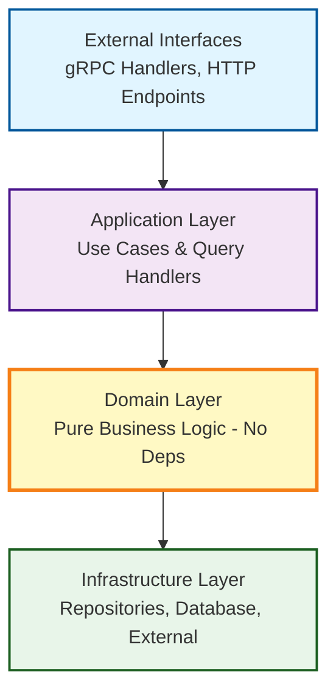

# Product Catalog Service

[](https://github.com/light-bringer/procat-service/actions/workflows/ci.yml)
[](https://goreportcard.com/report/github.com/light-bringer/procat-service)
[](https://github.com/light-bringer/procat-service/blob/main/go.mod)
[](LICENSE)

A production-ready Go microservice for product catalog management with dynamic pricing, built using **Domain-Driven Design**, **Clean Architecture**, and **CQRS** patterns with Google Cloud Spanner.

## Documentation

- **[USAGE.md](USAGE.md)** - Complete API usage guide with examples
- **[DESIGN.md](DESIGN.md)** - Architecture, patterns, and design decisions
- **[CI/CD Configuration](.github/README.md)** - GitHub Actions setup and troubleshooting

## Table of Contents

- [Features](#features)
- [Architecture](#architecture)
- [Getting Started](#getting-started)
  - [Prerequisites](#prerequisites)
  - [Installation](#installation)
  - [Running Locally](#running-locally)
- [Development](#development)
  - [Project Structure](#project-structure)
  - [Development Workflow](#development-workflow)
  - [Code Generation](#code-generation)
- [Testing](#testing)
  - [Unit Tests](#unit-tests)
  - [Integration Tests](#integration-tests)
  - [E2E Tests](#e2e-tests)
  - [Test Coverage](#test-coverage)
- [CI/CD](#cicd)
- [API Documentation](#api-documentation)
- [Database](#database)
- [Configuration](#configuration)
- [Contributing](#contributing)

## Features

- **Product Lifecycle Management**: Complete CRUD operations with status transitions (inactive → active → archived)
- **Dynamic Pricing**: Time-bound percentage discounts with precise decimal arithmetic
- **Price History Tracking**: Audit trail for all price changes with timestamps
- **Optimistic Locking**: Version-based concurrency control for safe concurrent updates
- **Event Sourcing**: Transactional outbox pattern for reliable event publishing
- **CQRS Pattern**: Separate command and query models for optimal performance
- **High Performance**: gRPC API with Protocol Buffers for efficient serialization

## Architecture

### Tech Stack

| Component | Technology |
|-----------|-----------|
| **Language** | Go 1.25.7+ |
| **Database** | Google Cloud Spanner |
| **API** | gRPC + Protocol Buffers |
| **Testing** | testify, Spanner emulator |
| **Linting** | golangci-lint v2 |
| **CI/CD** | GitHub Actions |

### Design Patterns

#### Clean Architecture



#### Domain-Driven Design (DDD)

The domain layer is completely isolated:
- ✅ Pure Go types and business logic
- ✅ `math/big.Rat` for precise money calculations
- ✅ Domain events as simple structs
- ❌ Zero external dependencies
- ❌ No `context.Context`, database, or framework imports

#### Golden Mutation Pattern

All write operations use a consistent atomic transaction pattern:

```go
func (it *Interactor) Execute(ctx context.Context, req Request) error {
    // 1. Load domain aggregate
    product, _ := it.repo.GetByID(ctx, req.ProductID)

    // 2. Execute business logic (validates automatically)
    product.ApplyDiscount(discount, it.clock.Now())

    // 3. Build atomic commit plan
    plan := committer.NewPlan()
    plan.Add(it.repo.UpdateMut(product))

    // 4. Store events in same transaction
    for _, event := range product.DomainEvents() {
        plan.Add(it.outboxRepo.InsertMut(event))
    }

    // 5. Commit atomically
    return it.committer.Apply(ctx, plan)
}
```

## Getting Started

### Prerequisites

- **Go**: 1.25.7 or later ([Download](https://go.dev/dl/))
- **Docker**: For running Spanner emulator ([Download](https://www.docker.com/))
- **Make**: Build automation (usually pre-installed on Unix systems)
- **protoc**: Protocol Buffer compiler (optional, for proto generation)

### Installation

```bash
# Clone the repository
git clone https://github.com/light-bringer/procat-service.git
cd procat-service

# Install Go dependencies
go mod download

# Verify installation
go version  # Should be 1.25.7+
docker --version
make --version
```

### Running Locally

```bash
# 1. Start Spanner emulator
docker compose up -d

# 2. Run database migrations
SPANNER_EMULATOR_HOST=localhost:9010 go run cmd/migrate/main.go \
  -instance=test-instance \
  -database=product-catalog-test

# 3. Run the service
go run cmd/server/main.go

# Service is now available at localhost:9090
```

**Quick test:**
```bash
# List gRPC services
grpcurl -plaintext localhost:9090 list

# Create a product
grpcurl -plaintext -d '{
  "name": "Test Product",
  "description": "A test product",
  "category": "electronics",
  "base_price": {"numerator": 9999, "denominator": 100}
}' localhost:9090 product.v1.ProductService/CreateProduct
```

## Development

### Project Structure

```
procat-service/
├── cmd/
│   ├── server/          # gRPC server entry point
│   └── migrate/         # Database migration tool
├── internal/
│   ├── app/product/
│   │   ├── domain/      # Pure business logic (DDD)
│   │   ├── usecases/    # Command handlers (write operations)
│   │   ├── queries/     # Query handlers (read operations)
│   │   ├── contracts/   # Interfaces and DTOs
│   │   └── repo/        # Spanner repository implementations
│   ├── models/          # Database table models (m_product, m_outbox)
│   ├── transport/
│   │   └── grpc/        # gRPC handlers and mappers
│   └── pkg/
│       ├── clock/       # Time abstraction for testing
│       ├── committer/   # Transaction commit plan
│       └── query/       # SQL query builder
├── proto/
│   └── product/v1/      # Protocol Buffer definitions
├── migrations/          # Spanner DDL migrations
├── tests/
│   ├── e2e/            # End-to-end tests
│   ├── integration/    # Integration tests
│   └── testutil/       # Test helpers
└── .github/workflows/  # CI/CD pipelines
```

### Development Workflow

1. **Make changes** to domain logic, use cases, or handlers
2. **Run tests** locally to verify functionality
3. **Format code** with `go fmt ./...`
4. **Commit changes** with descriptive messages
5. **Push** to trigger CI/CD pipeline

### Code Generation

```bash
# Regenerate Protocol Buffer code
make proto

# Or manually:
protoc --go_out=. --go-grpc_out=. proto/product/v1/*.proto
```

## Testing

### Unit Tests

Fast, isolated tests for domain logic (no database required).

```bash
# Run all unit tests
go test ./internal/app/product/domain/... -v

# With coverage
go test ./internal/app/product/domain/... -cover

# Specific test
go test ./internal/app/product/domain -run TestProduct_ApplyDiscount -v
```

**Characteristics:**
- ⚡ Fast execution (< 1 second)
- 🔬 Tests pure business logic
- 🚫 No external dependencies
- ✅ 100% coverage goal

### Integration Tests

Tests with real Spanner emulator, validates repository layer.

```bash
# Start Spanner emulator (if not already running)
docker compose up -d

# Run integration tests
go test -tags=integration ./tests/integration/... -v

# Specific integration test
go test -tags=integration ./tests/integration -run TestProductRepository_InsertMut -v
```

**What's tested:**
- Repository CRUD operations
- Database schema constraints
- Change tracking and dirty field detection
- Optimistic locking (version conflicts)
- Outbox event persistence

### E2E Tests

Full stack tests including migrations, use cases, and gRPC handlers.

```bash
# Complete E2E test suite (includes setup)
docker compose up -d
SPANNER_EMULATOR_HOST=localhost:9010 go run cmd/migrate/main.go \
  -instance=test-instance -database=product-catalog-test
SPANNER_EMULATOR_HOST=localhost:9010 go test ./tests/e2e/... -v -race

# Cleanup
docker compose down -v
```

**What's tested:**
- Complete product lifecycle (create → activate → discount → archive)
- Concurrent operations and race conditions
- Optimistic locking behavior
- Event publishing via outbox pattern
- API validation and error handling

### Test Coverage

```bash
# Generate coverage report
go test ./internal/... -coverprofile=coverage.out -covermode=atomic

# View in browser
go tool cover -html=coverage.out

# Coverage summary
go tool cover -func=coverage.out | grep total
```

**Coverage Goals:**
- Domain layer: **100%**
- Use cases: **>90%**
- Repositories: **>85%**
- Overall: **>80%**

## CI/CD

The project uses **GitHub Actions** for automated testing and deployment.

### CI Pipeline

Triggers on every **push** to `main`/`develop` and all **pull requests**.

**Pipeline Jobs:**

1. **Build** (2 min)
   - Compiles all packages
   - Builds server and migration binaries
   - Caches Go modules

2. **Unit Tests** (1 min)
   - Runs domain layer tests
   - Generates coverage report
   - Uploads to Codecov (optional)

3. **E2E Tests** (3-4 min)
   - Starts Spanner emulator with docker-compose
   - Runs database migrations
   - Executes full test suite with race detection
   - Tests 24 scenarios including concurrency

4. **Proto Check** (1 min)
   - Verifies proto files are up-to-date
   - Ensures generated code matches definitions

5. **Lint** *(Optional, non-blocking)*
   - Runs golangci-lint v2 with 27+ linters
   - Reports code quality issues
   - Does not block merges

6. **Vulnerability Check** *(Optional, non-blocking)*
   - Scans for known vulnerabilities
   - Checks dependency security
   - Provides early warning

### Running CI Locally

```bash
# Full CI pipeline simulation
docker compose up -d
SPANNER_EMULATOR_HOST=localhost:9010 go run cmd/migrate/main.go \
  -instance=test-instance -database=product-catalog-test

go build ./...
go test ./internal/... -v -race -coverprofile=coverage.txt
SPANNER_EMULATOR_HOST=localhost:9010 go test ./tests/e2e/... -v -race

golangci-lint run --config=.golangci.yml ./...

docker compose down -v
```

### CI Configuration

- **Go Version**: 1.25.7
- **golangci-lint**: v2.9.0
- **Test Timeout**: 10 minutes
- **Required Checks**: Build, Unit Tests, E2E Tests, Proto Check

See [`.github/workflows/ci.yml`](.github/workflows/ci.yml) for full configuration.

## API Documentation

### gRPC Service: `product.v1.ProductService`

#### Commands (Write Operations)

| Method | Description | Request | Response |
|--------|-------------|---------|----------|
| `CreateProduct` | Create a new product | `CreateProductRequest` | `CreateProductReply` |
| `UpdateProduct` | Update product details | `UpdateProductRequest` | `UpdateProductReply` |
| `UpdatePrice` | Change product price | `UpdatePriceRequest` | `UpdatePriceReply` |
| `ActivateProduct` | Make product available for sale | `ActivateProductRequest` | `ActivateProductReply` |
| `DeactivateProduct` | Make product unavailable | `DeactivateProductRequest` | `DeactivateProductReply` |
| `ApplyDiscount` | Add time-bound discount | `ApplyDiscountRequest` | `ApplyDiscountReply` |
| `RemoveDiscount` | Remove active discount | `RemoveDiscountRequest` | `RemoveDiscountReply` |
| `ArchiveProduct` | Soft delete product | `ArchiveProductRequest` | `ArchiveProductReply` |

#### Queries (Read Operations)

| Method | Description | Request | Response |
|--------|-------------|---------|----------|
| `GetProduct` | Get product by ID | `GetProductRequest` | `GetProductReply` |
| `ListProducts` | List with filtering & pagination | `ListProductsRequest` | `ListProductsReply` |

### API Examples

```bash
# Create Product
grpcurl -plaintext -d '{
  "name": "MacBook Pro 16\"",
  "description": "Professional laptop",
  "category": "electronics",
  "base_price": {"numerator": 249900, "denominator": 100}
}' localhost:9090 product.v1.ProductService/CreateProduct

# Update Price (with optimistic locking)
grpcurl -plaintext -d '{
  "product_id": "prod-123",
  "version": 1,
  "new_price": {"numerator": 229900, "denominator": 100}
}' localhost:9090 product.v1.ProductService/UpdatePrice

# Apply 20% Discount
grpcurl -plaintext -d '{
  "product_id": "prod-123",
  "version": 2,
  "discount_percent": 20.0,
  "start_date": "2025-01-01T00:00:00Z",
  "end_date": "2025-12-31T23:59:59Z"
}' localhost:9090 product.v1.ProductService/ApplyDiscount

# Get Product with Discount
grpcurl -plaintext -d '{
  "product_id": "prod-123"
}' localhost:9090 product.v1.ProductService/GetProduct

# List Products (filtered by category)
grpcurl -plaintext -d '{
  "category": "electronics",
  "status": "active",
  "page_size": 20
}' localhost:9090 product.v1.ProductService/ListProducts
```

## Database

### Schema

#### `products` Table

| Column | Type | Description |
|--------|------|-------------|
| `product_id` | STRING(36) | Primary key (UUID) |
| `name` | STRING(255) | Product name |
| `description` | STRING(1000) | Product description |
| `category` | STRING(100) | Category for filtering |
| `base_price_numerator` | INT64 | Price numerator (for precision) |
| `base_price_denominator` | INT64 | Price denominator (usually 100) |
| `discount_percent` | NUMERIC | Active discount (0-100) |
| `discount_start_date` | TIMESTAMP | Discount validity start |
| `discount_end_date` | TIMESTAMP | Discount validity end |
| `status` | STRING(20) | "inactive", "active", "archived" |
| `version` | INT64 | Optimistic locking version |
| `created_at` | TIMESTAMP | Creation timestamp |
| `updated_at` | TIMESTAMP | Last update timestamp |
| `archived_at` | TIMESTAMP | Archive timestamp (nullable) |

**Indexes:**
- Primary: `product_id`
- Secondary: `(category, status, created_at DESC)`
- Secondary: `(status, updated_at DESC)`

#### `outbox_events` Table

Stores domain events for reliable publishing.

| Column | Type | Description |
|--------|------|-------------|
| `event_id` | STRING(36) | Primary key (UUID) |
| `event_type` | STRING(100) | Event type (e.g., "product.created") |
| `aggregate_id` | STRING(36) | Product ID |
| `payload` | JSON | Event data |
| `status` | STRING(20) | "pending", "processing", "completed" |
| `created_at` | TIMESTAMP | Event creation time |
| `processed_at` | TIMESTAMP | Processing completion time |
| `retry_count` | INT64 | Number of retry attempts |
| `error_message` | STRING(1000) | Last error (if any) |

#### `price_history` Table

Audit trail for price changes.

| Column | Type | Description |
|--------|------|-------------|
| `history_id` | STRING(36) | Primary key |
| `product_id` | STRING(36) | Foreign key to products |
| `old_price_numerator` | INT64 | Previous price |
| `old_price_denominator` | INT64 | Previous denominator |
| `new_price_numerator` | INT64 | New price |
| `new_price_denominator` | INT64 | New denominator |
| `changed_at` | TIMESTAMP | Timestamp of change |
| `changed_by` | STRING(100) | User/system identifier |

### Migrations

Database migrations are managed via the custom migration tool:

```bash
# Run all pending migrations
SPANNER_EMULATOR_HOST=localhost:9010 go run cmd/migrate/main.go \
  -instance=test-instance \
  -database=product-catalog-test

# For production (requires credentials)
go run cmd/migrate/main.go \
  -instance=prod-instance \
  -database=product-catalog-prod
```

**Migration files:** `migrations/00X_*.sql`

## Configuration

### Environment Variables

| Variable | Description | Default | Required |
|----------|-------------|---------|----------|
| `SPANNER_EMULATOR_HOST` | Spanner emulator address | - | Local dev only |
| `SPANNER_PROJECT` | GCP project ID | - | Production |
| `SPANNER_INSTANCE` | Spanner instance name | - | Yes |
| `SPANNER_DATABASE` | Database name | - | Yes |
| `GRPC_PORT` | gRPC server port | `9090` | No |
| `LOG_LEVEL` | Logging level | `info` | No |

### Local Development Config

Create a `.env` file (gitignored):

```bash
SPANNER_EMULATOR_HOST=localhost:9010
SPANNER_PROJECT=test-project
SPANNER_INSTANCE=test-instance
SPANNER_DATABASE=product-catalog-test
GRPC_PORT=9090
LOG_LEVEL=debug
```

## Contributing

### Development Process

1. **Fork** the repository
2. **Create** a feature branch (`git checkout -b feature/amazing-feature`)
3. **Make** changes and add tests
4. **Run** tests locally (`go test ./... -v`)
5. **Commit** your changes (`git commit -m 'Add amazing feature'`)
6. **Push** to your fork (`git push origin feature/amazing-feature`)
7. **Open** a Pull Request

### Code Style

- Follow standard Go conventions ([Effective Go](https://go.dev/doc/effective_go))
- Run `go fmt ./...` before committing
- Pass golangci-lint checks (run `golangci-lint run ./...`)
- Write meaningful commit messages
- Add tests for new features

### Pull Request Guidelines

- ✅ All tests pass (unit, integration, E2E)
- ✅ Code coverage maintained or improved
- ✅ No new linter warnings
- ✅ Proto files regenerated if changed
- ✅ Documentation updated if needed

## License

MIT License - see [LICENSE](LICENSE) file for details.

---

**Built with ❤️ using Go, Spanner, and Clean Architecture principles.**
