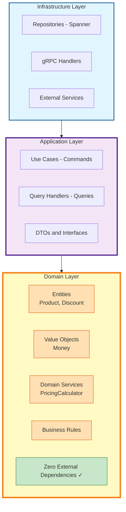

# Design Document

## Overview

Product Catalog Service is designed using Domain-Driven Design (DDD), Clean Architecture, and the Golden Mutation Pattern to create a maintainable, testable, and scalable microservice.

## Table of Contents

- [Architecture Principles](#architecture-principles)
- [Domain Model](#domain-model)
- [Design Patterns](#design-patterns)
- [Data Model](#data-model)
- [Concurrency & Consistency](#concurrency--consistency)
- [Event Sourcing](#event-sourcing)
- [Trade-offs & Decisions](#trade-offs--decisions)

## Architecture Principles

### Clean Architecture

The application follows the Dependency Rule: dependencies point inward, with the domain at the center:



### Layer Responsibilities

#### Domain Layer (`internal/app/product/domain/`)

**What it contains:**
- Product aggregate with business rules
- Value objects (Money, Discount)
- Domain events
- Business logic and validation

**What it does NOT contain:**
- No `context.Context`
- No database/infrastructure imports
- No protocol buffer types
- No frameworks or external libraries

**Example:**
```go
// Pure domain logic
func (p *Product) ApplyDiscount(discount *Discount, now time.Time) error {
    if p.status != StatusActive {
        return ErrCannotApplyToInactive
    }
    if p.discount != nil {
        return ErrDiscountAlreadyActive
    }
    p.discount = discount
    p.changes.MarkDirty(FieldDiscount)
    p.addEvent(&DiscountAppliedEvent{...})
    return nil
}
```

#### Application Layer (`internal/app/product/usecases/` and `queries/`)

**Use Cases (Commands):**
- Orchestrate domain operations
- Manage transactions via CommitPlan
- Handle cross-aggregate operations
- Coordinate with repositories

**Query Handlers (Queries):**
- Bypass domain for read performance
- Return DTOs optimized for clients
- May perform joins and aggregations
- No side effects or mutations

**Example:**
```go
func (i *Interactor) Execute(ctx context.Context, req *Request) error {
    // Load aggregate
    product, _ := i.repo.GetByID(ctx, req.ProductID)

    // Domain logic
    product.ApplyDiscount(discount, i.clock.Now())

    // Transactional commit
    plan := committer.NewPlan()
    plan.Add(i.repo.UpdateMut(product))
    plan.Add(i.outboxRepo.InsertMut(event))

    return i.committer.Apply(ctx, plan)
}
```

#### Infrastructure Layer (`internal/app/product/repo/`)

**Responsibilities:**
- Implements repository interfaces
- Maps domain ↔ database models
- Generates Spanner mutations
- Returns mutations without executing

**Example:**
```go
func (r *ProductRepo) UpdateMut(p *Product) (*spanner.Mutation, error) {
    updates := make(map[string]interface{})

    // Only update changed fields
    if p.Changes().Dirty(FieldDiscount) {
        discount := p.DiscountCopy()
        updates[m_product.DiscountPercent] = discount.Percentage()
    }

    if len(updates) == 0 {
        return nil, nil // No changes
    }

    updates[m_product.UpdatedAt] = time.Now()
    return r.model.UpdateMut(p.ID(), updates), nil
}
```

## Domain Model

### Aggregates

#### Product Aggregate

The Product is the aggregate root that enforces business invariants:

**State:**
- ID (UUID)
- Name, Description, Category
- Base Price (Money value object)
- Discount (nullable Discount value object)
- Status (Inactive, Active, Archived)
- Version (optimistic locking)
- Timestamps (created_at, updated_at, archived_at)

**Invariants:**
1. Cannot activate product twice
2. Cannot apply discount to inactive product
3. Cannot have multiple active discounts
4. Cannot modify archived products
5. Price must be positive
6. Discount must be 0-100%
7. Discount dates must be in UTC
8. Discount end must be after start

**State Transitions:**
```
         Inactive ──────> Active ──────> Archived
            │                │               │
            │                │               │
            └────────────────┴───────────────┘
                     (one-way to archived)
```

### Value Objects

#### Money

Precise decimal arithmetic using `math/big.Rat`:

```go
type Money struct {
    rat *big.Rat
}

// Store as fraction
NewMoney(249900, 100) // $2499.00
```

**Why big.Rat?**
- No floating-point rounding errors
- Exact calculations for financial data
- Transparent storage (numerator/denominator)
- Auditable and reversible

#### Discount

Represents a time-bound percentage discount:

```go
type Discount struct {
    percentage         float64
    startDate          time.Time
    endDate            time.Time
    discountMultiplier *big.Rat
}
```

**Validation:**
- Percentage: 0-100
- Dates in UTC timezone
- End date after start date
- Future dates allowed

### Domain Services

#### PricingCalculator

Encapsulates pricing logic:

```go
type PricingCalculator struct{}

func (pc *PricingCalculator) CalculateEffectivePrice(
    basePrice *Money,
    discount *Discount,
    now time.Time,
) *Money {
    if discount != nil && discount.IsValidAt(now) {
        return pc.ApplyDiscount(basePrice, discount.Multiplier())
    }
    return basePrice.Copy()
}
```

## Design Patterns

### Golden Mutation Pattern

**Problem:** Spanner requires explicit transaction management and mutation building.

**Solution:** Standardized pattern for all write operations:

```go
// 1. Load or create aggregate
product, err := repo.GetByID(ctx, id)

// 2. Execute domain logic (validates)
product.Activate()

// 3. Build commit plan
plan := committer.NewPlan()
plan.Add(repo.UpdateMut(product))  // Returns mutation

// 4. Add events to same transaction
for _, event := range product.DomainEvents() {
    plan.Add(outboxRepo.InsertMut(event))
}

// 5. Apply atomically
committer.Apply(ctx, plan)
```

**Rules:**
1. Repositories return mutations (don't apply)
2. Use cases build and apply plans
3. Events and data in same transaction
4. All writes go through domain

### CQRS (Command Query Responsibility Segregation)

**Commands (Writes):**
- Must go through domain aggregate
- Enforce business rules
- Create domain events
- Use optimistic locking

**Queries (Reads):**
- Bypass domain for performance
- Use read-optimized DTOs
- Direct database queries
- Calculate at query time (e.g., effective price)

**Example:**

```go
// Command: Must validate
func (i *CreateProductInteractor) Execute(ctx, req) (string, error) {
    product, err := domain.NewProduct(req.Name, req.Price, ...)
    if err != nil {
        return "", err // Domain validation
    }
    // ... commit
}

// Query: Optimized for reads
func (q *GetProductQuery) Execute(ctx, req) (*DTO, error) {
    // Direct DB read + calculations
    row := client.Single().ReadRow(...)
    dto.EffectivePrice = calculatePrice(row, time.Now())
    return dto, nil
}
```

### Change Tracking

Optimize database updates by tracking dirty fields:

```go
type ChangeTracker struct {
    dirtyFields map[string]bool
}

// In domain
func (p *Product) SetName(name string) error {
    p.name = name
    p.changes.MarkDirty(FieldName)  // Track change
    return nil
}

// In repository
func (r *Repo) UpdateMut(p *Product) *Mutation {
    updates := make(map[string]interface{})

    if p.Changes().Dirty(FieldName) {
        updates["name"] = p.Name()  // Only changed fields
    }

    if len(updates) == 0 {
        return nil  // Skip empty updates
    }

    return UpdateMutation(p.ID(), updates)
}
```

**Benefits:**
- Fewer write operations
- Lower database costs
- Better performance
- Clear audit trail

### Transactional Outbox

Reliably publish events using database as queue:

```go
// 1. Domain creates event intent
p.addEvent(&ProductCreatedEvent{
    ProductID: p.id,
    Name:      p.name,
})

// 2. Use case enriches with metadata
event := &OutboxEvent{
    EventID:     uuid.New(),
    EventType:   "product.created",
    AggregateID: p.ID(),
    Payload:     json.Marshal(domainEvent),
    Status:      "pending",
    CreatedAt:   time.Now(),
}

// 3. Store in same transaction
plan.Add(repo.UpdateMut(product))
plan.Add(outboxRepo.InsertMut(event))  // Atomic!
committer.Apply(ctx, plan)

// 4. Background processor publishes events
//    (out of scope for this service)
```

**Benefits:**
- Guaranteed delivery (at least once)
- Events and state always consistent
- Can retry failed publishes
- Survives service restarts

## Data Model

### Database Schema Design

#### Products Table

```sql
CREATE TABLE products (
  product_id STRING(36) NOT NULL,
  name STRING(255) NOT NULL,
  description STRING(1000),
  category STRING(100) NOT NULL,

  -- Precise money representation
  base_price_numerator INT64 NOT NULL,
  base_price_denominator INT64 NOT NULL,

  -- Nullable discount fields
  discount_percent NUMERIC,
  discount_start_date TIMESTAMP,
  discount_end_date TIMESTAMP,

  -- State management
  status STRING(20) NOT NULL,
  version INT64 NOT NULL,  -- Optimistic locking

  -- Timestamps
  created_at TIMESTAMP NOT NULL,
  updated_at TIMESTAMP NOT NULL,
  archived_at TIMESTAMP,

  PRIMARY KEY (product_id)
);

-- Query optimization indexes
CREATE INDEX idx_products_category_status
  ON products(category, status, created_at DESC);

CREATE INDEX idx_products_status_updated
  ON products(status, updated_at DESC);
```

**Design Decisions:**

1. **Money as Fraction:** Store price as numerator/denominator for exact arithmetic
2. **Nullable Discount:** Discount fields NULL when no discount applied
3. **Version Column:** Enables optimistic locking for concurrent updates
4. **Status Enum:** Simple string for status instead of separate table
5. **Timestamps:** All in UTC for consistency

#### Outbox Events Table

```sql
CREATE TABLE outbox_events (
  event_id STRING(36) NOT NULL,
  event_type STRING(100) NOT NULL,
  aggregate_id STRING(36) NOT NULL,
  payload JSON NOT NULL,
  status STRING(20) NOT NULL,
  created_at TIMESTAMP NOT NULL,
  processed_at TIMESTAMP,
  retry_count INT64 NOT NULL DEFAULT (0),
  error_message STRING(1000),

  PRIMARY KEY (event_id)
);

-- For background processing
CREATE INDEX idx_outbox_status_created
  ON outbox_events(status, created_at);
```

**Design Decisions:**

1. **JSON Payload:** Flexible event structure without schema changes
2. **Status Tracking:** Enable idempotent processing and retries
3. **Separate Table:** Events independent of product lifecycle
4. **No Foreign Key:** Allow event retention after product deletion

#### Price History Table

```sql
CREATE TABLE price_history (
  history_id STRING(36) NOT NULL,
  product_id STRING(36) NOT NULL,
  old_price_numerator INT64 NOT NULL,
  old_price_denominator INT64 NOT NULL,
  new_price_numerator INT64 NOT NULL,
  new_price_denominator INT64 NOT NULL,
  changed_at TIMESTAMP NOT NULL,
  changed_by STRING(100),

  PRIMARY KEY (history_id)
);

-- For audit queries
CREATE INDEX idx_price_history_product
  ON price_history(product_id, changed_at DESC);
```

## Concurrency & Consistency

### Optimistic Locking

Prevents lost updates in concurrent modifications:

```go
type Product struct {
    version int64  // Incremented on each update
}

// Request includes version
type Request struct {
    ProductID string
    Version   int64  // Client's version
}

// Validation
func (i *Interactor) Execute(ctx, req) error {
    product, _ := i.repo.GetByID(ctx, req.ProductID)

    if req.Version != 0 && product.Version() != req.Version {
        return ErrVersionMismatch  // Concurrent modification!
    }

    product.UpdatePrice(newPrice)
    product.IncrementVersion()  // Bump version

    // ... commit
}
```

**Update Mutation:**
```go
func (r *Repo) UpdateMut(p *Product) *Mutation {
    updates["version"] = p.Version()  // New version

    // WHERE product_id = ? AND version = ?
    // Fails if version changed (another update happened)
}
```

### Race Condition Handling

**Scenario:** Two requests try to apply discount simultaneously:

```
Request A: ApplyDiscount(20%)   version=1
Request B: ApplyDiscount(15%)   version=1

1. A reads product (version=1)
2. B reads product (version=1)
3. A applies discount, writes version=2
4. B tries to write version=2, but DB has version=2
   → Spanner rejects write (version mismatch)
5. B retries: reads product (version=2), sees discount exists
   → Domain returns ErrDiscountAlreadyActive
```

**Result:** No race condition, last write doesn't silently win.

## Event Sourcing

### Event Types

All events stored in outbox for external consumption:

```go
// Domain events (simple structs)
type ProductCreatedEvent struct {
    ProductID string
    Name      string
    Category  string
    Price     *Money
}

type DiscountAppliedEvent struct {
    ProductID string
    Percentage float64
    StartDate  time.Time
    EndDate    time.Time
}

type PriceUpdatedEvent struct {
    ProductID string
    OldPrice  *Money
    NewPrice  *Money
}
```

### Event Enrichment

Use cases add metadata before storing:

```go
func enrichEvent(domainEvent DomainEvent) *OutboxEvent {
    return &OutboxEvent{
        EventID:     uuid.New().String(),
        EventType:   domainEvent.Type(),  // "product.created"
        AggregateID: domainEvent.AggregateID(),
        Payload:     marshalPayload(domainEvent),
        Status:      "pending",
        CreatedAt:   time.Now().UTC(),
        RetryCount:  0,
    }
}
```

### Event Processing (Out of Scope)

Background processor would:
1. Poll for events with status="pending"
2. Publish to message bus (Pub/Sub, Kafka, etc.)
3. Mark as "completed" or "failed"
4. Retry with exponential backoff

## Trade-offs & Decisions

### Architecture Decisions

| Decision | Rationale | Trade-off |
|----------|-----------|-----------|
| **Clean Architecture** | Testability, independence, flexibility | More layers, more files |
| **DDD** | Pure business logic, domain experts can read code | Steeper learning curve |
| **CQRS** | Optimized reads and writes | Code duplication between commands/queries |
| **big.Rat for Money** | Exact arithmetic, no rounding errors | Slightly slower than float64 |
| **Optimistic Locking** | Better concurrency than pessimistic locks | Clients must handle version conflicts |
| **Transactional Outbox** | Guaranteed event consistency | Events delayed until background processor runs |
| **gRPC Only** | High performance, type-safe | No REST API (could add gateway) |
| **Spanner** | Global consistency, unlimited scale | Vendor lock-in, requires emulator for local dev |

### What's NOT Included

**Authentication & Authorization:**
- No user management
- No JWT/OAuth validation
- Assumption: API gateway handles auth

**Background Processing:**
- Outbox events not processed
- No event publisher
- Assumption: Separate service handles this

**Configuration Management:**
- No config files
- No vault integration
- Environment variables only

**Observability:**
- Basic logging only
- No metrics/tracing
- Assumption: Infrastructure handles this

### Future Enhancements

**If scaling becomes an issue:**
1. Add read replicas for queries
2. Implement caching layer (Redis)
3. Separate read and write databases

**If features expand:**
1. Multiple concurrent discounts
2. Tiered pricing (wholesale, retail)
3. Inventory management
4. Product variants (size, color)

**If requirements change:**
1. REST API via gRPC-gateway
2. GraphQL for flexible queries
3. Event streaming to analytics
4. Full-text search (Elasticsearch)

## Further Reading

- [Clean Architecture (Uncle Bob)](https://blog.cleancoder.com/uncle-bob/2012/08/13/the-clean-architecture.html)
- [Domain-Driven Design (Eric Evans)](https://www.domainlanguage.com/ddd/)
- [CQRS Pattern (Martin Fowler)](https://martinfowler.com/bliki/CQRS.html)
- [Transactional Outbox](https://microservices.io/patterns/data/transactional-outbox.html)
- [Google Cloud Spanner Best Practices](https://cloud.google.com/spanner/docs/best-practice-list)
